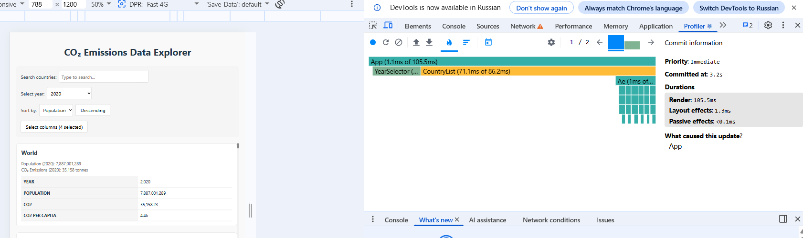
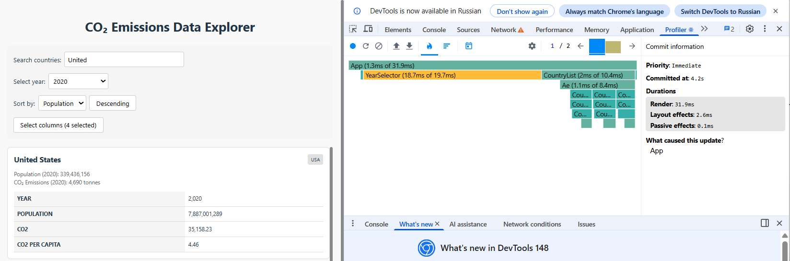
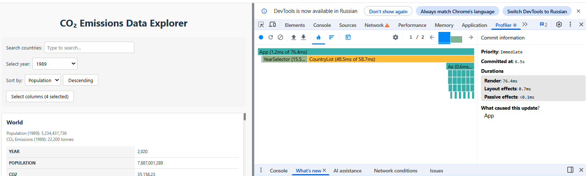
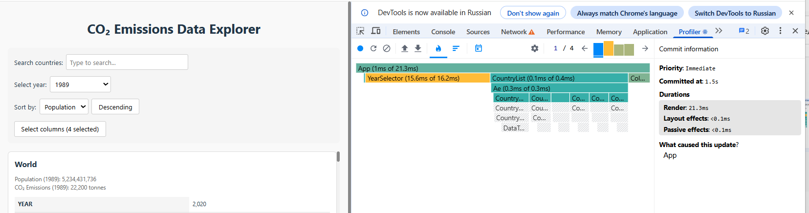

# Performance Optimization Report

## Baseline Measurements

### Interaction A: Sort countries

- **Commit duration**: 524.3 ms
- **Render duration**: 524.1 ms
- **Screenshot**: 

### Interaction B: Search countries

- **Commit duration**: 28.7 ms
- **Render duration**: 28.5 ms
- **Screenshot**: ![screenshot]

### Interaction C: Change year

- **Commit duration**: 35.4 ms
- **Render duration**: 35.2 ms
- **Screenshot**: ![screenshot]

### Interaction D: Toggle column

- **Commit duration**: 375.1 ms
- **Render duration**: 374.9 ms
- **Screenshot**: ![screenshot]

## Optimized Measurements

### Interaction A: Sort countries

- **Commit duration**: 106.9 ms
- **Render duration**: 105.5 ms
- **Screenshot**: 

### Interaction B: Search countries

- **Commit duration**: 31.9 ms
- **Render duration**: 34.6 ms
- **Screenshot**: 

### Interaction C: Change year

- **Commit duration**: 77.2 ms
- **Render duration**: 76.4 ms
- **Screenshot**: 

### Interaction D: Toggle column

- **Commit duration**: 21.5 ms
- **Render duration**: 21.3 ms
- **Screenshot**: 

## Summary of Improvements

| Interaction      | Baseline (ms) | Optimized (ms) | Improvement |
| ---------------- | ------------- | -------------- | ----------- |
| Sort countries   | 524.3         | 106.9          | 79,6%       |
| Search countries | 28.7          | 31.9           | -11,1%      |
| Change year      | 35.4          | 77.2           | -118,1%     |
| Toggle column    | 375.1         | 21.5           | 94,2%       |
| **Average**      | **963,5**     | **237,5**      | **75,4%** |