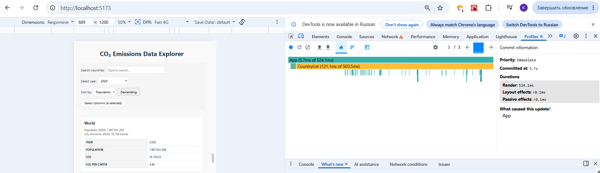
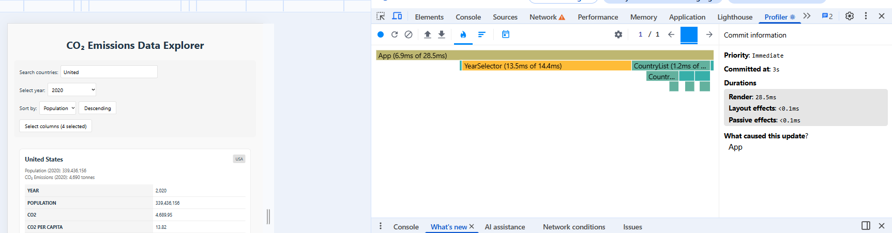
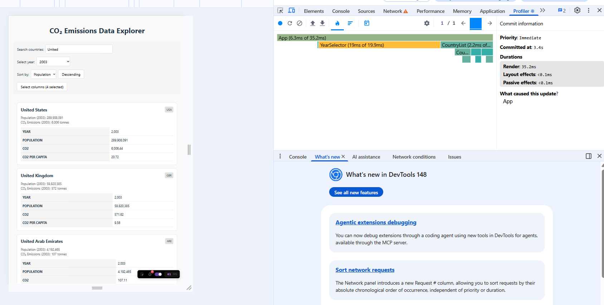
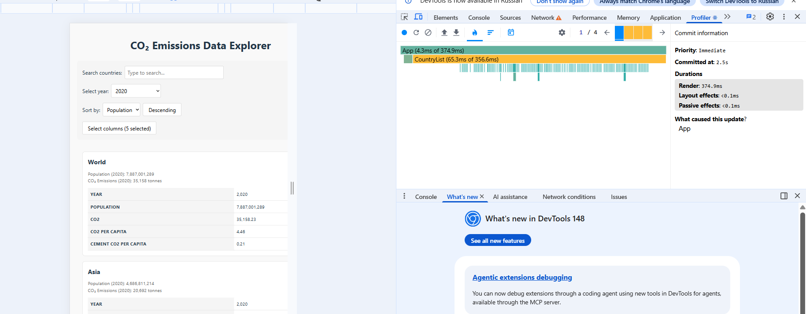

# Performance Optimization Report

## Baseline Measurements

### Interaction A: Sort countries

- **Commit duration**: 3.7 s
- **Render duration**: 524.1 ms
- **Screenshot**: 

### Interaction B: Search countries

- **Commit duration**: 3 s
- **Render duration**: 28.5 ms
- **Screenshot**: ![screenshot]

### Interaction C: Change year

- **Commit duration**: 3.4 s
- **Render duration**: 35.2 ms
- **Screenshot**: ![screenshot]

### Interaction D: Toggle column

- **Commit duration**: 2.5 s
- **Render duration**: 374.9 ms
- **Screenshot**: ![screenshot]